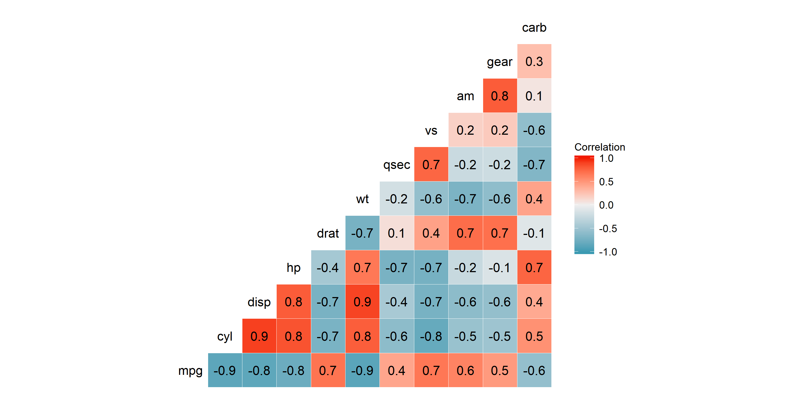
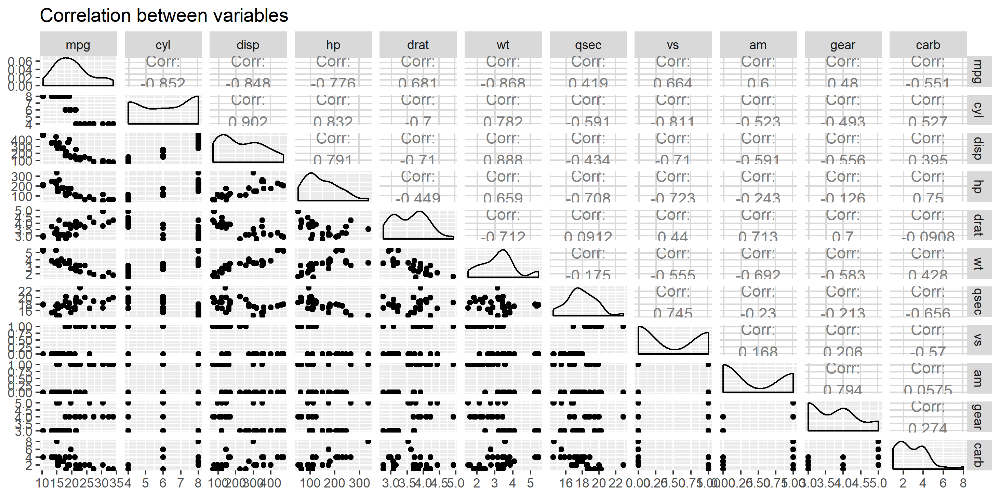
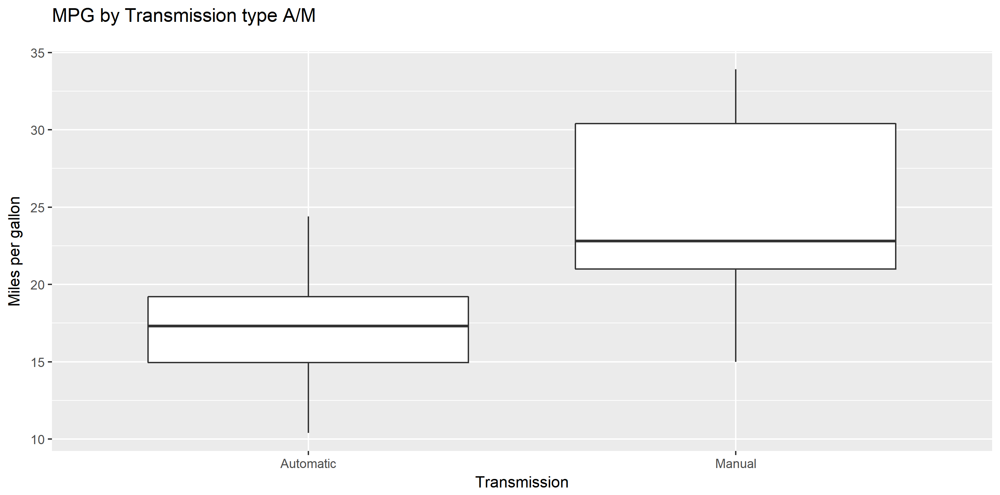
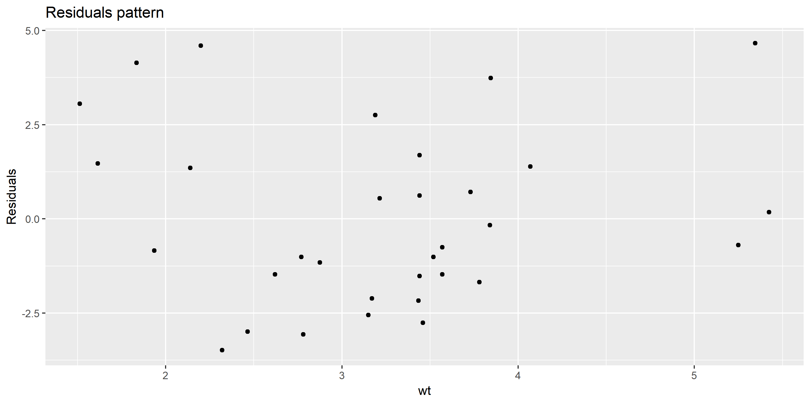

```{r setup, include=FALSE}
knitr::opts_chunk$set(echo = TRUE)
```

## 1. Introduction

Motor Trend is a magazine about the automobile industry. They are looking at a data set of a collection of cars and they are interested in exploring the relationship between a set of variables and miles per gallon (MPG) (outcome). They are particularly interested in the following two questions:

1. Is an automatic or manual transmission better for MPG

2. Quantify the MPG difference between automatic and manual transmissions


```{r, echo=FALSE}
library(data.table)
library(ggplot2)
library(GGally)
require(datasets)
data(mtcars)

#View(mtcars)

data_cars <- as.data.table(mtcars)

```


## 2.1. Exploratory data analyses

For the exploratory data analysis purpose I will present: 

1. Sample of data containing set of cars with different parameters 

2. Structure of the dataset 

3. Summary plots representing correlations and dependencies

```{r}
#Number of observations and variables
dim(data_cars)

# Number of observations for automatic (1) and manual (0) transmission
data_cars[, .N, by = am]

# 10 samples from dataset
head(data_cars, 10)

# Baisc dataset structure
str(data_cars)

# Correlation between variables
ggcorr(data_cars, 
       name = "Correlation",
       palette = "RdBu", 
       label = TRUE)

# Plots summary with correlation between variables
ggpairs(data_cars, 
       title = "Correlation between variables",  
       axisLabels = "show", 
        columnLabels = colnames(data_cars))

```

 


 

# 2.2. EDA: Transmission types comparison

I set alpha-value at 0.5 and run a t-test:

```{r}

auto <- data_cars[ am %in% 0]
man <- data_cars[ am %in% 1]

# Median of MPG per transmission
data_cars[, median(mpg), by = am]

# Median of MPG per transmission
data_cars[, mean(mpg), by = am]

t.test(auto$mpg, man$mpg)

```

 

I conclude that at significant level 5% there is no evidence to prove H0 hypothesis that there is no difference between A/M transmission. I accept alternative hypothesis that true difference in means (A/M transmission) is not equal to 0. Nevertheless I conduct further analysis to confirm.


Now I will follow distribution of the MPG between A/M transmission:

```{r}
# Number of observations per transmission
data_cars[, .N, by = am]

ggplot(data_cars[, mpg, am], 
       aes(factor(am), mpg)) +
  geom_boxplot() +
  labs(title = "MPG by Transmission type A/M\n", 
       y="Miles per gallon", 
       x="Transmission") +
  scale_x_discrete(labels = c("Automatic","Manual")) 

```

I conclude that answering question "Is an automatic or manual transmission better for MPG" will no be precise because for manual (1) transmission I have only 13 observations and for automatic (0) transmission I have 19 observations which is 46% more observations comparing to automatic one.

Nevertheless based on the medians, means and boxplot distribution for A/M transmission I may assume that automatic transmission is more efficient in terms of MPG consumption.


# 3. First modeling attempt with all variables

First I am going to prepare linear model for all variables and analyze coefficients and p-values at 5% significance level.

Based on the below results I observe coefficients for each variable (outcome is MPG) with intercept equal to 17.59704 but for all variable I notice p-value higher than 5%. It means that I do not have prove to reject H0 hipotesis at significant level 5% -> using all variables in model I observe that there may not be linear dependencies between variables and outcome (MPG).

In the next part I am going to analyze correlation and multicollinearity in order to select correct model. 

```{r}
# Basic first model -> comment is above
summary(lm(mpg~., data = data_cars))

```

# 4.1. Correlation

Based on the output from correlation values diagram and plots I observe that there are significant correlations between most variables and outcome variable MPG. In the next parti I will analyze multicollinearity in order to select and omit necessary variables.

# 4.2. Multicollinearity

Based on the correlation values diagram and plots I observe that almost all variables have strong linear relationship with each other, nevertheless I going to eliminate multicollinearity left the ones that may be useful to analyze. To do that I will omit below variables (others are presented in the section below):

-	 cyl:	 Number of cylinders

-	 disp	 Displacement (cu.in.)

-	 hp	 Gross horsepower

-	 drat	 Rear axle ratio

-	 vs	 V/S

-	 gear	 Number of forward gears

-	 carb	 Number of carburetors

# 5. Model choosing

I am going to test linear model that contains only 3 independent variables (because other variables have strong linear relationship with those 3 and I omit them due to multicollinearity issue):

-	 wt	 Weight (1000 lbs)

-	 qsec	 1/4 mile time

-	 am	 Transmission (0 = automatic, 1 = manual)

Model is following: Y(mpg) = -3.1855*(wt) + 1.5998*(qsec) + 4.2995*(am)

```{r}

summary(lm(mpg~.-1, data_cars[, c("mpg", "wt", "qsec", "am")]))

```

# 6. Residuals analyzis

I analyzed both model Y(mpg) = -3.1855*(wt) + 1.5998*(qsec) + 4.2995*(am) using residuals plot and based on the below results I conclude that:

- Data related to model Y(mpg) = -3.1855*(wt) + 1.5998*(qsec) + 4.2995*(am) no need a transformation. Plot shows random pattern and it is expected.

```{r}
ggplot(data_cars[, c("mpg", "wt", "qsec")], 
       aes(x = wt, 
           y = resid(lm(mpg ~ ., data_cars[, c("mpg", "wt", "qsec", "am")])))) +
  geom_point() +
  ggtitle("Residuals pattern", subtitle = NULL) +
  ylab("Residuals")

```

 

# 7. Final model selecting

Based on the previous analysis final model is following: 

Y(mpg) = -3.1855*(wt) + 1.5998*(qsec) + 4.2995*(am)

```{r}

summary(lm(mpg~.-1, data_cars[, c("mpg", "wt", "qsec", "am")]))

```

# 7. Executive summary

1. I conclude with hypothesis that there is true difference between A/M transmission and it is not equal to 0.

2. I conclude that answering question "Is an automatic or manual transmission better for MPG" will no be precise because for manual (1) transmission I have only 13 observations and for automatic (0) transmission I have 19 observations which is 46% more observations comparing to automatic one.

3. Based on the medians, means and boxplot distribution for A/M transmission I may assume that automatic transmission is more efficient in terms of MPG consumption.

4. Linear model contains only 3 independent variables: Y(mpg) = -3.1855*(wt) + 1.5998*(qsec) + 4.2995*(am)  because other variables from dataset have strong linear relationship with those 3 and I omit them due to multicollinearity issue.

5. Therefore given the above analysis, the question of cats with A/M transmission is not answered and has to be considered in the context of weight and acceleration speed but based on the dataset I get there is not enough observation and between key variables are strong linear relationship causing multicollinearity.

